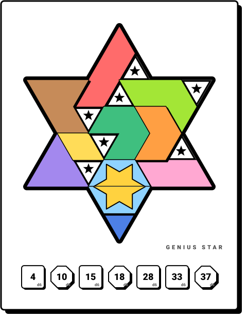
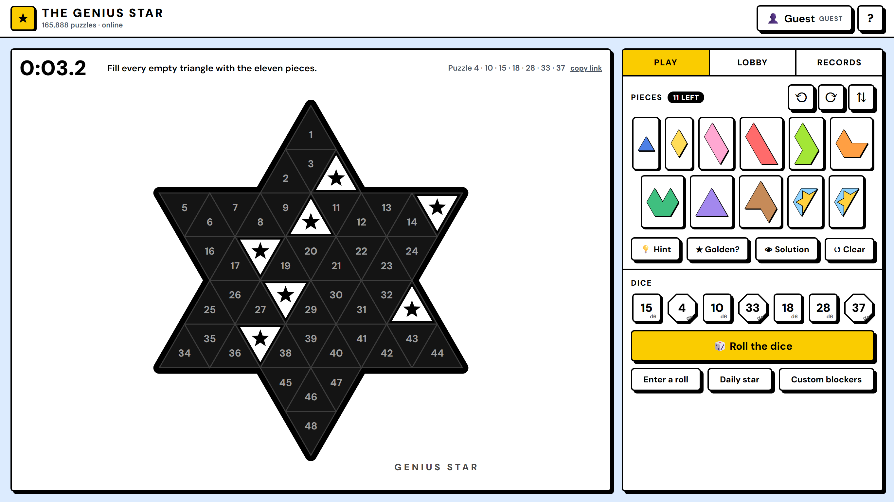
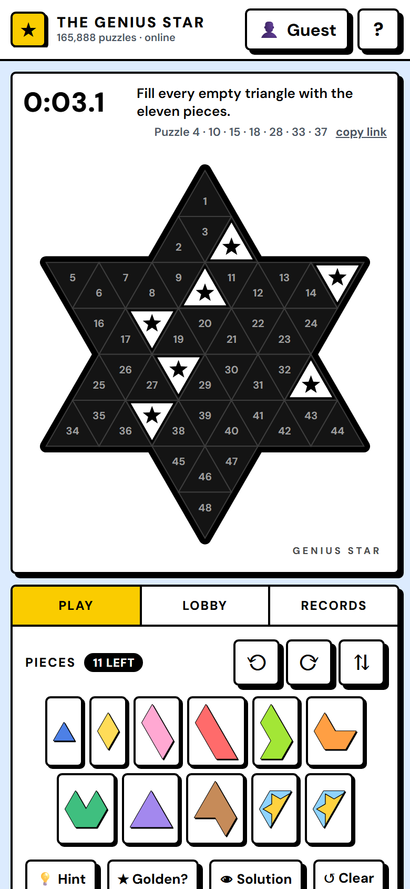

<p align="center">
  
</p>

<h1 align="center">The Genius Star</h1>

<p align="center">
  Roll seven dice, block seven triangles, fill the star with eleven pieces.<br>
  Alone against the clock, or against four friends on the same roll.
</p>

<p align="center">
  <a href="https://genius-star.vercel.app"></a>
  
  
  <a href="LICENSE"></a>
  <a href="https://buymeacoffee.com/al1shan"></a>
</p>

---

The Genius Star is the star-shaped sibling of The Genius Square, made by The Happy Puzzle Company.
This is a browser version of it that keeps everything that makes the physical game tick:

- the 48-triangle board, numbered 1–48 exactly like the plastic one;
- the seven original dice (four six-sided, three eight-sided) with their real face numbers;
- the eleven pieces, including the two light-blue halves that join into the **Golden Star**.

Every one of the 165,888 rolls the dice can produce has been solved by the bundled solver: all of them
have a solution, and 97,422 (58.7 %) can be finished with the Golden Star whole. Those are the same
numbers printed on the box.

**[Play it here](https://genius-star.vercel.app)** — nothing to install, works on phones.

## Features

**Solo.** Roll, drag, rotate, race the timer. Hints that respect the pieces you have already placed,
a full solution when you give up, a "is the Golden Star possible?" check, a daily puzzle, custom blocker
layouts, and a link for every puzzle so a friend can try the same roll.

**Together.** Create a lobby, share the five-letter code, and up to five players get the same roll at
the same moment. The lobby shows who is still solving and who has finished; the fastest hint-free
finisher wins the round, and a Golden Star finish counts double. If the host leaves, the next player
takes over.

**Your record.** Sign in with an email and password to keep best times, Golden Star counts and a
full game history (solo and lobby rounds with your finishing position) on your profile. Or stay a
guest: everything is kept in your browser.

**One screen.** On a desktop the board, the pieces, the dice and the lobby fit the window without
scrolling. On a phone the board takes the full width and you drag with a finger.

## Screenshots

<p align="center">
  
</p>
<p align="center">
  
</p>

## How to play

1. **Roll the dice.** A white star blocker lands on each of the seven numbered triangles.
2. **Fill the rest.** Drag pieces from the tray onto the star; a piece snaps in when every triangle
   under it is free. Drag it off (or tap it) to send it back.
3. **Turn pieces** with `Space` or `R` (hold `Shift` for the other way) and flip with `F` — all of
   this works while you are holding a piece, and the scroll wheel rotates too. On a phone, tap a
   selected piece to rotate it.
4. **Finish the star.** The timer stops when the last piece is down. If the two light-blue halves
   form the hexagon with the golden star, that is a double win.

Other keys: `H` hint, `N` new roll, `Esc` drop the piece you are holding, `?` help.

## How it works

Everything is plain HTML, CSS and JavaScript — no framework, no bundler, no npm dependencies.

- **Board and pieces** live on a triangular grid. Each triangle is addressed by a row and a column;
  rotations and reflections are integer maps on tri-coordinates, so the twelve orientations of every
  piece are computed once at start-up ([`js/geometry.js`](js/geometry.js), [`js/pieces.js`](js/pieces.js)).
- **The solver** ([`js/solver.js`](js/solver.js)) treats a puzzle as an exact-cover problem: all legal
  placements are pre-computed and a backtracking search always fills the emptiest cell first. A puzzle
  solves in a few milliseconds, which is what powers hints, the solution button and the Golden Star check.
  `npm run verify` runs the whole 165,888-roll check (about four minutes).
- **Multiplayer** uses Supabase Realtime: a lobby is a channel named by its code, players publish a
  tiny presence state (nickname, pieces left, finish time) and the host broadcasts the roll of each
  round. Nothing about lobbies is stored on a server.
- **Accounts and history** use Supabase Auth and one Postgres table with row-level security, so a
  player can only ever read or write their own rows ([`supabase/schema.sql`](supabase/schema.sql)).
- **Design** follows the [neobrutalism](https://www.neobrutalism.dev/) system: 2 px black borders,
  hard 4 px shadows, 5 px corners, DM Sans, the official yellow accent. The page ships with a strict
  Content-Security-Policy and self-hosts its one font and one library.

Without a Supabase project the same code runs in *local mode*: guest play, history in the browser,
and lobbies that work between tabs of one browser — handy for development.

## Run it locally

```bash
git clone https://github.com/alishan-alv/genius-star.git
cd genius-star
npm start          # http://localhost:8765  (or just open index.html)
```

`npm run verify` checks all 165,888 rolls; `npm run check` syntax-checks the scripts.

## Deploy your own

1. **Supabase** (free tier is enough): create a project, run [`supabase/schema.sql`](supabase/schema.sql)
   in the SQL editor, set *Authentication → URL configuration → Site URL* to your domain, and copy the
   Project URL and the anon/publishable key from *Project Settings → API*.
2. **Vercel**: import the repository (framework *Other*, no build command), add the environment
   variables `SUPABASE_URL` and `SUPABASE_ANON_KEY`, deploy. [`api/config.js`](api/config.js) hands those
   two public values to the page; [`vercel.json`](vercel.json) adds the security headers.

For local development against the real backend, copy `config.local.example.json` to
`config.local.json` and fill in the two values (the file is git-ignored).

## Project layout

```
index.html                 the page
css/style.css              styling, desktop one-screen grid, phone layout
js/geometry.js             triangular grid, star board, transforms, outlines
js/pieces.js               the eleven pieces
js/dice.js                 the seven dice, daily seed
js/solver.js               exact-cover solver
js/backend.js              Supabase adapter + local mode
js/game.js                 board, drag & drop, timer, records, shared widgets
js/account.js              sign in / sign up, nickname, profile & history
js/lobby.js                lobbies: presence, rounds, scoreboard
js/support.js              the occasional, dismissible "buy me a coffee" card
api/config.js              Vercel function exposing the public config
supabase/schema.sql        tables, RLS policies, sign-up trigger
tools/                     local server, exhaustive verifier, hero + brand card sources
docs/                      images for this README
robots.txt sitemap.xml     search engine basics
site.webmanifest icons/    installable web app metadata
og.png                     social preview image (generated from tools/brand-cards.html)
```

Security notes and known limitations are in [AUDIT.md](AUDIT.md).

## Support

The game is free, has no ads, no trackers and no paywalled hints, and it will stay that way.
It is built and maintained by one person in his spare time.

If it made a break better, you can [buy me a coffee](https://buymeacoffee.com/al1shan) ☕ —
it is the whole business model. Starring the repository or telling a friend who likes puzzles
helps just as much.

<a href="https://buymeacoffee.com/al1shan"></a>

## Credits

The Genius Star is a trademark of The Happy Puzzle Company; this is an unofficial fan project and is
not affiliated with them. The board numbering, dice faces and piece shapes were cross-checked against
the printed game and against independent solvers by
[John Rudge](https://github.com/johnrudge/genius_star), [Oleksandr Manzyuk](https://github.com/manzyuk/genius-star)
and [Benjamin Turner](https://github.com/turnerbenjamin/genius-star-solver).
The DM Sans font in `fonts/` is used under the SIL Open Font License 1.1. The code is MIT — see
[LICENSE](LICENSE).
